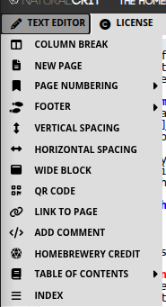

# Homebrewery User Guide

**Audience:** First-time authors who want D&D-style pages without a layout app  
**Product:** [The Homebrewery](https://homebrewery.naturalcrit.com) (NaturalCrit)  
**Renderer:** V3 (recommended for new documents)  
**Last updated:** 10 October 2026

This basic guide walks you from a blank brew to a printable PDF, and covers the most known and basic snippets you will find in the app, to help you start your journey to creating your very first professional looking 5e module. You do not need to memorize every snippet. Homebrewery injects the hard parts for you; you only need a few Markdown habits and a handful of Homebrewery-specific lines.

---

## Table of contents

1. [What Homebrewery is](#1-what-homebrewery-is)
2. [Start a new document](#2-start-a-new-document)
3. [Core Markdown syntax](#3-core-markdown-syntax)
4. [Text Editor](#4-text-editor)
  - [Column Break](#41-column-break)
  - [New Page](#42-new-page)
  - [Page Numbering](#43-page-numbering)
  - [Footer](#44-footer)
  - [Vertical Spacing](#45-vertical-spacing)
  - [Horizontal Spacing](#46-horizontal-spacing)
  - [Wide Block](#47-wide-block)
  - [QR Code](#48-qr-code)
  - [Link to page](#49-link-to-page)
  - [Add Comment](#410-add-comment)
  - [Homebrewery Credit](#411-homebrewery-credit)
  - [Table of Contents](#412-table-of-contents)
  - [Index](#413-index)
5. [Player's Handbook snippets](#5-players-handbook-snippets)
  - [Spell](#51-spell)
  - [Spell List](#52-spell-list)
  - [Class Feature](#53-class-feature)
  - [Quote](#54-quote)
  - [Note](#55-note)
  - [Descriptive Text Box](#56-descriptive-text-box)
  - [Monster Stat Block (unframed)](#57-monster-stat-block-unframed)
  - [Monster Stat Block](#58-monster-stat-block)
  - [Wide Monster Stat Block](#59-wide-monster-stat-block)
  - [Front Cover Page](#510-front-cover-page)
  - [Inside Cover Page](#511-inside-cover-page)
  - [Part Cover Page](#512-part-cover-page)
  - [Back Cover Page](#513-back-cover-page)
  - [Magic Item](#514-magic-item)
  - [Artist Credit](#515-artist-credit)
6. [Images, tables et al.](#6-images-tables-et-al)
  - [Images](#61-images)
  - [Tables](#62-tables)
  - [Fonts](#63-fonts)
  - [License](#64-license)
7. [Editor tools](#7-editor-tools)
   - [History](#history)
   - [Undo](#undo)
   - [Redo](#redo)
   - [Fold All](#fold-all)
   - [Unfold All](#unfold-all)
   - [Clean your Code](#clean-your-code)
   - [Brew Editor](#brew-editor)
   - [Style Editor](#style-editor)
   - [Snippets](#snippets)
   - [Properties](#properties)
   - [Settings](#settings)
8. [Export to PDF](#8-export-to-pdf)
9. [Quick troubleshooting](#9-quick-troubleshooting)
10. [Where to go next](#10-where-to-go-next)

---

## 1. What Homebrewery is

Homebrewery is a **browser-based editor** that turns Markdown into pages that look like official fifth-edition Dungeons & Dragons books: parchment backgrounds, two-column body text, class tables, notes, and monster stat blocks.

You type on the left. A live preview updates on the right. Snippets in the toolbar insert ready-made PHB-style blocks so you rarely have to build a layout from scratch.

**What it is good at**

- Adventure text, subclasses, spells, magic items, and bestiary pages
- Sharing a live link with playtesters
- Printing a letter-sized PDF that matches the preview

**What it is not**

- A word processor with automatic pagination (you place page breaks yourself)
- An official Wizards of the Coast product (you are responsible for the licenses on any art or text you publish)

If something looks “off,” it is usually a missing page break, overflowing columns, or print settings—not a broken document. The later sections cover those cases.

---

## 2. Start a new document

### 2.1 Open the editor

1. Go to [https://homebrewery.naturalcrit.com](https://homebrewery.naturalcrit.com).
2. Sign in with Google if you want the brew saved to your account (strongly recommended).
3. Start a new brew (Home / **New**, or [https://homebrewery.naturalcrit.com/new](https://homebrewery.naturalcrit.com/new)).
4. Keep the **V3** renderer for new work. Legacy still opens old documents; new snippets and styling live on V3.

### 2.2 Learn the workspace


| Area                   | What it does                                          |
| ---------------------- | ----------------------------------------------------- |
| **Brew editor** (left) | Your Markdown source                                  |
| **Preview** (right)    | Paginated pages as they will print                    |
| **Snippet bar**        | Inserts PHB blocks, tables, images, page numbers      |
| **Style tab**          | Optional CSS (skip this until you need custom colors) |
| **Metadata**           | Title, description, tags, and sharing options         |
| **History**            | Local backups of recent edits                         |


**Gentle advice:** save early, give the brew a real title, and write one short paragraph first. Confirm the preview updates before you add stat blocks. That single check saves a lot of “did I type in the wrong place?” confusion.

### 2.3 Use snippets instead of memorizing syntax

Place the cursor where the content should appear, then pick a snippet (for example **PHB → Monster Stat Block** or **Tables → …**). Homebrewery pastes a complete, valid example. Replace the placeholder names and numbers. You can always trim extra rows later.

---

## 3. Core Markdown syntax

Homebrewery uses standard Markdown for everyday writing. These four patterns cover most body text.

### Headings

Use `#` through `######`. In PHB-style themes, `#` and `##` look like chapter and section titles; `###` is a common in-column heading.

```markdown
# Chapter 3: The Saltmarsh Heist

## The Docks at Night

### Optional: Talking to the Harbor Master
```

**Tip:** Headings can feed the Table of Contents snippet. Prefer real heading lines over bold-only titles when you want a ToC later.

### Bold and italics

```markdown
The **ancient** door is *slightly ajar*.

You can combine ***bold italics*** for spell names or trait titles.
```

- `**bold**` → **bold**
- `*italics*` → *italics*
- `***both***` → ***both***

In monster traits, Homebrewery convention is italic-bold on the trait name:

```markdown
***Keen Smell.*** The hound has advantage on Wisdom (Perception) checks that rely on smell.
```

### Lists

**Unordered**

```markdown
- Grappling hook
- 50 feet of silk rope
- A very nervous mule
```

**Ordered**

```markdown
1. Approach the gate in disguise.
2. Bribe or bluff the watch.
3. Find the ledger in the counting house.
```

Nested lists indent with two to four spaces. Keep list items short; long paragraphs belong outside the list so columns still balance.

### A few extras you will see immediately

```markdown
> This blockquote becomes a **note** in the PHB theme.

A line with only a colon adds a little vertical space:

:

[Harbor map](https://example.com) and 
```

You can write HTML when you must, but stay in Markdown until a snippet cannot do the job.

---

## 4. Text Editor

The **Text Editor** menu (pencil icon on the snippet bar) is the layout toolkit. These snippets do not draw monsters or class charts. They decide **where** text sits: pages, columns, numbers, footers, contents, and a few extras.



**How to use any of them**

1. Click in the brew where the control should go.
2. Open **Text Editor** and pick the snippet.
3. Homebrewery pastes the syntax at the cursor. Change placeholder words; leave the `\page`, `{{ }}`, and class names unless you know you need a different look.

`\pagebreak` and `\columnbreak` work as aliases of `\page` and `\column` if you are used to GM Binder.

### 4.1 Column Break

**Menu:** Text Editor → **Column Break**  
**Inserts:** `\column`

The default PHB page is **two columns**. Text fills the left column, then spills into the right. `\column` does **not** create extra columns. It **forces a break** at that point in the existing two-column flow.

```markdown
## The Counting House

Clerks shout over the clatter of coin.

\column

## The Vault Door

Two iron bars and a sleeping mastiff.
```

Use it when the next heading should start at the **top of the right column**, not halfway down the left. If text peeks off the right edge of the page, a third CSS column is overflowing: add **New Page**, shorten the copy, or move a tall block. Do not try to invent a third on-page column.

### 4.2 New Page

**Menu:** Text Editor → **New Page**  
**Inserts:** `\page`

Homebrewery **does not paginate for you**. A page grows until you tell it to stop. If text spills off the parchment, the preview is warning you—not failing.

`\page` is a **contextual** break: Homebrewery only honors it **alone, at the start of a line**. That rule keeps `\page` inside sentences or code examples from accidentally splitting your brew.

```markdown
The cultists scatter into the alleys.

\page

## Aftermath
When dawn reaches the docks, the ledger is gone.
```

**Rules**

- Put `\page` on its **own line**, with nothing before it on that line.
- Optional curly modifiers style the **next** page, for example `\page{wide}` or a class you defined in the Style tab.
- A counter can appear beside each `\page` line in the editor (counting from page 2). That number is a **map of physical pages**. It is not the printed folio unless you also add a page-number snippet.

Insert a break when a heading is stranded at the bottom of a column, a table is clipped, or a chapter should start on a fresh sheet. If content is only slightly over, shorten a paragraph before you add another page.

### 4.3 Page Numbering

**Menu:** Text Editor → **Page Numbering**

`\page` only starts a new sheet. The PHB-style digit in the bottom corner is a **separate** snippet. Place it on each page that should show a folio, usually just after the `\page` that begins that sheet (and on page 1, near the top of the brew).

#### Page Number (by hand)

**Inserts:** `{{pageNumber 1}}`

Type any label you want: `1`, `iv`, `A-3`. Homebrewery prints that text as the folio and does **not** update it when you insert pages. Use this for a one-pager, a preface in Roman numerals, or a spread that must say a fixed string.

```markdown
{{pageNumber iv}}
```

#### Auto-incrementing Page Number

**Inserts:** `{{pageNumber,auto}}`

Homebrewery counts physical pages and paints the digit on the outer corner (odd pages right, even pages left in the PHB theme). Put this snippet on **every** content page that should show a number.

```markdown
{{pageNumber,auto}}
```

#### Variable Auto Page Number

**Inserts:** `{{pageNumber $[HB_pageNumber]}}`

`$[HB_pageNumber]` is the built-in counter. It supports simple math and reassignment, so you can print a custom scheme in body text as well as in the footer. For everyday work this behaves like auto numbering with more room to grow.

```markdown
{{pageNumber $[HB_pageNumber]}}
```

#### Skip Page Number Increment this Page

**Inserts:** `{{skipCounting}}`

Put this on covers, inside covers, and credits sheets. That page prints **without** advancing the published count (and typically without a folio). The table of contents generator also ignores skipped pages when it maps heading → page number.

```markdown
{{skipCounting}}

# Saltmarsh Gazetteer
```

#### Restart Numbering

**Inserts:** `{{resetCounting}}`

Put this on the first real content page so that sheet becomes printed **1**, which is what a contents list should match. Combine it with an auto (or variable) page-number snippet on the same page.

```markdown
{{skipCounting}}

# Saltmarsh Gazetteer

\page

{{resetCounting}}
{{pageNumber,auto}}
```

**Practical pattern:** skip decorative sheets, restart on the first numbered page, prefer auto or `$[HB_pageNumber]` on every content page, and never type a digit on the `\page` line itself.

### 4.4 Footer

**Menu:** Text Editor → **Footer**  
**Inserts:** `{{footnote PART 1 | SECTION NAME}}`

The footer is the small running title next to the page number (chapter name, part name, or adventure title). Replace the placeholder. Keep it short; long footers collide with the digit.

**Footer from H1** through **Footer from H6** scan **upward from the cursor** for the most recent heading of that level and paste that heading’s text into the footnote. Place the cursor in the chapter you are numbering, then pick **Footer from H1** (or H2) instead of typing the name twice.

```markdown
{{pageNumber,auto}}
{{footnote THE DOCKS AT NIGHT}}
```

Add a footer **per chapter** (or per page if the running title changes), not after every paragraph. Cover-page snippets already flip left/right footer sides for facing pages; after a cover, check that page 1 of the body sits on the recto if you care about print imposition.

### 4.5 Vertical Spacing

**Menu:** Text Editor → **Vertical Spacing**  
**Inserts:** a line of four colons (`::::`)

Each colon is a small vertical gap. The snippet drops several at once so you can nudge a heading, note, or illustration down the column without empty paragraphs. Delete colons to tighten; add more (or extra `:` lines) to push content toward a natural column end when a hard `\column` would fight the PDF engine.

```markdown
## The Vault Door

::::

Two iron bars and a sleeping mastiff.
```

### 4.6 Horizontal Spacing

**Menu:** Text Editor → **Horizontal Spacing**  
**Inserts:** `{{width:100px}}` as an inline spacer

Use this between words, icons, or short phrases when you need a fixed gap that a normal space will not give you. Change `100px` to `1cm`, `2em`, or another length. This is not a column tool; for layout across the page, use **Column Break** or **Wide Block**.

```markdown
Name {{width:100px}} Signature _______________
```

### 4.7 Wide Block

**Menu:** Text Editor → **Wide Block**  
**Inserts:** a `{{wide ... }}` wrapper

Content inside spans **both columns**: chapter intros, large tables, and anything that looks crushed in a single column. After a wide block, flow returns to column one. Add `\column` if you need to rebalance the text that follows.

```markdown
{{wide
### Downtime in Saltmarsh

While the party recovers, each character may pursue one downtime activity from the table below.
}}
```

CSS columns can sit oddly around a wide strip. If the PDF drops a wide section to the bottom of the page, avoid a hard `\column` immediately above `{{wide` and prefer Chrome for export.

### 4.8 QR Code

**Menu:** Text Editor → **QR Code**  
**Inserts:** an image whose URL is a generated QR code

The snippet points at a QR service and encodes your brew’s **Share** link when the brew is saved. If the brew is still on `/new` (unsaved), it falls back to the Homebrewery home URL. Change the `data=` query to any URL: a battle map, a Patreon page, or a handout.

```markdown
 {width:100px;mix-blend-mode:multiply}
```

`mix-blend-mode:multiply` lets the code sit on parchment without a white box. Save the brew before you rely on the Share URL inside the code.

### 4.9 Link to page

**Menu:** Text Editor → **Link to page**  
**Inserts:** `[Click here](#p3) to go to page 3`

Each preview page has an id `p1`, `p2`, `p3`, … matching **physical** sheets (the same count as the editor’s `\page` map), not the printed folio after skip/restart. Change the number to the sheet you want. In the live brew and in many PDFs, the link jumps to that page.

```markdown
See the harbor map on [page 3](#p3).
```

Use this for “continued on page …” notes. For a contents list with dotted leaders and mapped numbers, use **Table of Contents** instead of hand-writing every `#p` link.

### 4.10 Add Comment

**Menu:** Text Editor → **Add Comment**  
**Shortcut:** `Ctrl+/` (or `Cmd+/`) wraps a selection

Comments are notes **for you**. They do not appear in the preview, the share view, or the PDF. Use them for balance reminders, art to-dos, or “do not print this sidebar yet.”

```markdown
<!-- TODO: replace this rumor table after playtest. -->
```

Do not put secrets you would not want in the brew source; comments still live in the file if someone opens the editor.

### 4.11 Homebrewery Credit

**Menu:** Text Editor → **Homebrewery Credit**  
**Inserts:** a `{{homebreweryCredits}}` badge with the Homebrewery name and link

Place it on a credits or back-cover page if you want to acknowledge the tool. Replace nothing required; you may move it with the usual position styles later. This is courtesy, not a license for the game content you wrote.

```markdown
{{homebreweryCredits
Made With

{{homebreweryIcon}}

The Homebrewery
[Homebrewery.Naturalcrit.com](https://homebrewery.naturalcrit.com)
}}
```

### 4.12 Table of Contents

**Menu:** Text Editor → **Table of Contents**  
**Inserts:** a generated `{{toc,wide}}` list from your headings

The generator reads **H1–H3** by default from the preview, maps each heading to a page using skip/restart, and pastes Markdown links with PHB-style leaders. Insert it **after** your headings exist, usually on its own early page. If you add chapters later, run the snippet again (or replace the old `{{toc,wide}}` block). It will not update live by itself.

```markdown
{{toc,wide
# Contents

- ### [{{ The Docks at Night}}{{ 1}}](#p3)
 - #### [{{ The Counting House}}{{ 2}}](#p4)
}}
```

**Include in ToC up to H3 / H4 / H5 / H6** wrap a region in `{{tocDepthH4 ... }}` (and similar) so headings in that region go deeper than the default H3. After you add a depth wrapper, **regenerate** the contents snippet.

You can also mark blocks so their headings are skipped or forced in: CSS `--TOC:exclude` or `--TOC:include` on a `{{block}}`. Monster titles and note headings are often excluded so they do not clutter the list. Prefer real `#` / `##` / `###` lines in the body; bold-only titles will not appear.

The list is `wide` and can flow across the two columns. You do not need a manual `\column` inside the ToC.

### 4.13 Index

**Menu:** Text Editor → **Index**  
**Inserts:** a sample `{{index,wide,columns:5;}}` with hanging entries

Unlike the ToC, the index is **not** generated from headings. You maintain the entries: headwords, subentries, and page numbers. Change `columns:5` if you want fewer or more columns. Alphabetize as you add terms. Update page numbers when you insert `\page` breaks, or wait until layout is frozen and pass through once.

```markdown
{{index,wide,columns:3;
##### Index
- Harbor
 - docks, 1
 - vault door, 2
- Ledger, 3
}}
```

Indent subentries with two spaces after the `-`. Use an en-dash for ranges (`26-27`). Place the index at the back of the brew.

---

## 5. Player's Handbook snippets

**PHB** stands for **Player's Handbook**: the core fifth-edition Dungeons & Dragons player rulebook (the book with classes, spells, and equipment). Homebrewery’s **PHB** menu copies that look—parchment notes, spell write-ups, class features, monster frames, and cover pages—so a homebrew module can sit next to the official book without a layout app.

These snippets live under the book icon on the snippet bar (**PHB**), not under Text Editor. Text Editor still decides pages and columns; PHB decides the *game* blocks on those pages. Place the cursor, insert the snippet, then replace the joke placeholder names with your own. Leave the `{{ }}` wrappers and `::` definition lists; those are the visual structure.

Official D&D names and art are still Wizards of the Coast’s. You are responsible for what you publish.

### 5.1 Spell

**Menu:** PHB → **Spell**

Inserts a single spell write-up: name as `####`, italic school line, then **Casting Time**, **Range**, **Components**, and **Duration** as definition-list rows (`::` between label and value). Body paragraphs follow. That hanging-indent pattern is the same one the PHB uses.

```markdown
#### Tide Lantern
*2nd-level evocation*

**Casting Time:** :: 1 action
**Range:** :: Touch
**Components:** :: V, S, M (a pinch of dry salt)
**Duration:** :: Concentration, up to 1 hour

A flame, equivalent in brightness to a torch, springs from an object that you touch.
The effect looks like a regular flame, but it creates no heat and doesn't use oxygen.
```

There is **no** `{{spell}}` wrapper. The heading level and `::` rows are enough for the theme. Keep the school line italic. Put spells in a column, or wrap several in `{{wide}}` only if you are laying out a full-page appendix.

### 5.2 Spell List

**Menu:** PHB → **Spell List**  
**Inserts:** `{{spellList,wide ... }}`

A two-column, full-width list grouped by level (`##### Cantrips (0 Level)` through `##### 9th Level`) with bullet spell names. Use it on a class or subclass page under “Spell List.”

```markdown
{{spellList,wide
##### Cantrips (0 Level)
- Light
- Prestidigitation

##### 1st Level
- Fog Cloud
- Shield
}}
```

Delete levels the class does not get. Drop `,wide` (or wrap a narrower list) if you want the list in one column beside flavor text. The snippet fills itself with random joke names; replace every bullet.

### 5.3 Class Feature

**Menu:** PHB → **Class Feature**

Inserts the **opening spread** of a class chapter: “As a [class], you gain the following class features,” then Hit Points, Proficiencies, optional Spellcasting Ability, and Equipment. Definition lists again use `::`. Place this **after** your class table (the table itself is a **Tables** snippet, in a later chapter).

```markdown
## Class Features

As a tidewarden, you gain the following class features.

#### Hit Points
**Hit Dice:** :: 1d10 per tidewarden level
**Hit Points at 1st Level:** :: 10 + your Constitution modifier
**Hit Points at Higher Levels:** :: 1d10 (or 6) + your Constitution modifier per tidewarden level after 1st

#### Proficiencies
**Armor:** :: Light armor, medium armor, shields
**Weapons:** :: Simple weapons, martial weapons
**Tools:** :: Navigator's tools

**Saving Throws:** :: Strength, Wisdom
**Skills:** :: Choose two from Athletics, Perception, Survival, Insight
```

The snippet’s sample class names are jokes (`archivist`, `fancyman`). Rename everything before you share. After this block, add each numbered feature as a `###` heading and body text in the same chapter.

### 5.4 Quote

**Menu:** PHB → **Quote**  
**Inserts:** `{{quote ... }}` with nested `{{attribution ... }}`

A pull-quote in the PHB italic style, with author and work on the attribution line. Use it to open a chapter or break a long column of rules.

```markdown
{{quote
The sword glinted in the dim light, its edges keen and deadly.

{{attribution Eolande Blackwood, *The Blade of Destiny*}}
}}
```

Keep quotes short. Long quotations belong in a **Descriptive Text Box** if the GM should read them aloud.

### 5.5 Note

**Menu:** PHB → **Note**  
**Inserts:** `{{note ... }}`

The yellow (parchment) sidebar the PHB uses for asides, optional rules, and “this is interesting but not the main procedure.” Tables and lists work inside a note.

```markdown
{{note
##### Time to Drop Knowledge
Harbor Watch will ignore a bribe under 5 gp. They will not ignore a talking gull.
}}
```

### 5.6 Descriptive Text Box

**Menu:** PHB → **Descriptive Text Box**  
**Inserts:** `{{descriptive ... }}`

The green-gray read-aloud box. Use it for boxed text the DM recites when the party enters a room. Same inner Markdown as a note (headings, lists, tables); different job and color.

```markdown
{{descriptive
##### The Counting House
Salt and ink hang in the air. Two clerks freeze with quills raised. Behind them, a mastiff opens one eye.
}}
```

Do not put mechanical DCs inside a descriptive box unless the table wants to hear them. Mechanics belong in a **Note** or in the body.

### 5.7 Monster Stat Block (unframed)

**Menu:** PHB → **Monster Stat Block (unframed)**  
**Inserts:** `{{monster ... }}` with **no** `frame` class

Same stat layout as the framed block (name, type line, AC/HP/Speed, ability grid, traits, actions) without the heavy parchment border. Use it for an NPC in a town chapter, a simple beast in a sidebar, or when your own background art would clash with the frame.

Keep the `___` rules and `::` rows. You are only dropping the picture-frame chrome.

### 5.8 Monster Stat Block

**Menu:** PHB → **Monster Stat Block**  
**Inserts:** `{{monster,frame ... }}`

The default MM/PHB look: single column, textured frame, gold rules. Use it when the creature fits in one column (most ordinary stat blocks).

```markdown
{{monster,frame
## Pier Shade
*Medium undead, neutral evil*
___
**Armor Class** :: 13
**Hit Points** :: 22 (5d8)
**Speed** :: 30 ft., swim 30 ft.
___
|STR|DEX|CON|INT|WIS|CHA|
|:---:|:---:|:---:|:---:|:---:|:---:|
|6 (−2)|16 (+3)|10 (+0)|8 (−1)|12 (+1)|14 (+2)|
___
**Senses** :: darkvision 60 ft., passive Perception 11
**Languages** :: the languages it knew in life
**Challenge** :: 1 (200 XP) {{bonus **Proficiency Bonus** +2}}
___
***Sunlight Weakness.*** While in sunlight, the shade has disadvantage on attack rolls, ability checks, and saving throws.

### Actions
***Chilling Touch.*** *Melee Spell Attack:* +4 to hit, reach 5 ft., one target. *Hit:* 9 (2d6 + 2) necrotic damage.
}}
```

Replace sample numbers; leave `::`, `___`, and the ability table. Trait names use `***Name.***` The `{{bonus ...}}` chip on the Challenge line is part of the current snippet.

If the block is too tall: shorten flavor, move it higher in the column, or switch to the wide variant. Splitting with `___` mid-block is a last resort and a **fixed** break.

### 5.9 Wide Monster Stat Block

**Menu:** PHB → **Wide Monster Stat Block**  
**Inserts:** `{{monster,frame,wide ... }}`

The same framed block spanning **both** columns, like a large MM entry. Use it for legendary or lair-action creatures, or a full-width “poster” under a chapter heading.

`wide` restarts column flow after the block. Put story text after the closing `}}`, then add `\column` if you need to rebalance.

### 5.10 Front Cover Page

**Menu:** PHB → **Front Cover Page**  
**Inserts:** `{{frontCover}}` plus logo, title, subtitle, `{{banner HOMEBREW}}`, footnote, cover art, and a trailing `\page`

This is a full **physical** first sheet. Replace the title, subtitle, banner word, flavor footnote, and image URL. The snippet already ends with `\page`, so the next thing you type is page 2.

Pair it with **Skip Page Number** from Text Editor so the cover is not printed as folio 1. Cover snippets also flip left/right footer sides for the pages that follow.

```markdown
{{frontCover}}
{{skipCounting}}

{{logo }}

# Saltmarsh Gazetteer
## A Dockside Heist
___
{{banner HOMEBREW}}
```

You are responsible for cover-art licenses. The sample images are Homebrewery assets for testing.

### 5.11 Inside Cover Page

**Menu:** PHB → **Inside Cover Page**  
**Inserts:** `{{insideCover}}` with title, a center watercolor mask around art, logo, and `\page`

Use the sheet immediately behind the front cover: credits, “a book by,” or a second title treatment. Skip numbering here too if you do not want it in the published count.

### 5.12 Part Cover Page

**Menu:** PHB → **Part Cover Page**  
**Inserts:** `{{partCover}}` with `# PART X`, a subtitle, an edge-masked image, and `\page`

Drop this at the start of Part 2, Part 3, and so on in a long adventure. Change `PART X` and the subtitle. These sheets often skip the folio as well, then **Restart Numbering** only if you want each part to begin at page 1 (most modules keep one run of numbers).

### 5.13 Back Cover Page

**Menu:** PHB → **Back Cover Page**  
**Inserts:** `{{backCover}}` with a short blurb, a rule, a “for use with any fantasy roleplaying ruleset” line, art, and a white Homebrewery logo

This is the last physical page. Put your elevator pitch in the blurb paragraphs (`:` between them is vertical space). Add **Homebrewery Credit** from Text Editor if you want that badge as well as the logo already on this snippet.

### 5.14 Magic Item

**Menu:** PHB → **Magic Item**

A DMG-style item: `####` name, italic type/rarity/attunement line, then body text. Like **Spell**, there is no special wrapper—the heading and italics carry the style.

```markdown
#### Tide Lantern
*Wondrous item, uncommon (requires attunement)*
:
This brass lantern burns with cold salt-fire. While lit, it sheds bright light in a 20-foot radius in fog that would otherwise heavily obscure the area.
```

The lone `:` under the rarity line is a small gap before the description. Change rarity and attunement to match your table.

### 5.15 Artist Credit

**Menu:** PHB → **Artist Credit**  
**Inserts:** `{{artist,top:90px,right:30px ... }}`

A small caption block you pin on the page (cover art, a map, a full-page illustration). Set `top` / `right` / `left` / `bottom` so it sits on a quiet corner of the image. Include the work title and a link to the artist.

```markdown
{{artist,top:90px,right:30px
##### Bird with autumn foliage
[by L. Prang & Co.](https://www.loc.gov/resource/pga.14148)
}}
```

Add one credit per sourced image. This does not replace a license page; it is the on-page caption.

---

## 6. Images, tables et al.

This chapter covers four snippet menus you will use after layout and PHB blocks are in place: **Images**, **Tables**, **Fonts**, and **License**, in that order. Insert them from the snippet bar the same way as before: cursor first, then the snippet, then replace placeholders.

### 6.1 Images

**Menu:** **Images** (picture icon)

Homebrewery does not upload files from your disk. Every picture must be a **public URL**. You are responsible for the license on that art; pair sourced images with **PHB → Artist Credit**.

#### Image

The basic snippet: Markdown image plus a curly-brace style list.

```markdown
 {width:325px}
```

- **Alt text** in `![...]` — a short description if the URL fails.
- **URL** in `(...)` — a reachable link; a private or expired host shows a blank.
- `{width:...}` — size. Use `px`, `cm`, or `%` (`width:100%` fills the column).

#### Image Wrap Left / Image Wrap Right

Same as Image, with wrap already set so body text flows beside the picture. Put the snippet **before** the paragraphs that should wrap. PNG files with transparent backgrounds wrap more cleanly than photos with a hard rectangle.

```markdown
 {width:280px,margin-right:-3cm,wrapLeft}
```

`wrapRight` and `margin-left` mirror this on the other side. Tweak the margin so type does not crowd the art.

#### Background Image

Pins art to the **page**, not the text flow, with `position:absolute` plus `top` / `right` / `bottom` / `left`. Use it for a map in the corner, a cover illustration, or a faint scene behind a column.

```markdown
 {position:absolute,top:50px,right:30px,width:280px}
```

Absolute images do not push text aside. If type runs over the art, wrap instead, or leave a quieter margin.

#### Watercolor Splatter

Drops a stain or splash (coffee, ink, watercolor) on the page. Replace the sample if you want a different asset; otherwise use it as decoration. Keep splatters away from small type.

#### Watercolor Center / Edge / Corner

These **mask** your image so it fades like a painted stain instead of a hard rectangle.

- **Center** — `{{imageMaskCenterN,--offsetX:0%,--offsetY:0%,--rotation:0 ... }}` for a blot in the middle of the page or a portrait.
- **Edge** — sub-snippets for **Top**, **Right**, **Bottom**, **Left**. The image bleeds off that edge (`imageMaskEdgeN,--offset:10%,--rotation:...`).
- **Corner** — **Top-Left**, **Top-Right**, **Bottom-Left**, **Bottom-Right**, using `--offsetX` / `--offsetY`.

Insert the mask, replace the sample URL, then nudge offset and rotation until the stain sits where you want it. Homebrewery’s **Example Masks and Images** brew is worth cloning once so you can see mask and source side by side.

```markdown
{{imageMaskEdge4,--offset:16%,--rotation:0
 {position:absolute,width:100%,bottom:0px,left:0px}
}}
```

If an image vanishes in the PDF, the usual causes are a private URL or print **Background graphics** turned off.

#### Watermark

**Inserts:** `{{watermark Homebrewery}}`

Diagonal faint text across the page (draft, “PLAYTEST,” your studio name). Change the word inside the block. Use it on review copies; skip it on a final print unless you want it in the bound book.

### 6.2 Tables

**Menu:** **Tables**

Use GitHub-style tables. Colons in the separator row set alignment (`:---` left, `:---:` center, `---:` right). Insert a snippet first, then edit cells.

#### Table

A single-column PHB table (character advancement, loot, a short encounter chart).

```markdown
##### Character Advancement
| Experience Points | Level | Proficiency Bonus |
|:------------------|:-----:|:-----------------:|
| 0 | 1 | +2 |
| 300 | 2 | +2 |
```

#### Wide Table

Wraps the table in `{{wide}}` so it spans both columns. Use this for weapons lists, class-like charts with many columns, or anything that looks crushed in one column.

#### Split Table

Two small tables side by side inside `{{column-count:2}}` (for example Typical Difficulty Classes). Use it when one narrow table would leave an awkward empty column, but a full-wide table would be too sparse.

```markdown
##### Typical Difficulty Classes
{{column-count:2
| Task Difficulty | DC |
|:----------------|:--:|
| Easy | 10 |
| Medium | 15 |

| Task Difficulty | DC |
|:----------------|:--:|
| Hard | 20 |
| Very hard | 25 |
}}
```

#### Class Tables

On the PHB theme, **Tables → Class Tables** pastes a 1st–20th progression with the PHB frame. Variants:

- **Martial** — Level, Proficiency Bonus, Features (narrow, beside body text).
- **Full Caster / Half Caster** — extra columns for cantrips, spells, and slots; usually **wide**.
- **Third Caster Spell Table** — the slim chart you add to a martial subclass that gains limited casting.
- **(unframed)** — the same data without the parchment border.

Leave `{{classTable,frame,decoration}}` (and `,wide` when you need it). Full-caster headers often use two rows; a cell that continues from the row above starts with `^|`.

```markdown
{{classTable,frame,decoration,wide
##### The Tidewarden
| Level | Proficiency Bonus | Features | Tides |
|:-----:|:-----------------:|:---------|:-----:|
| 1st | +2 | Harbor Sense | 2 |
| 2nd | +2 | Fighting Style | 2 |
}}
```

Write class feature text with **PHB → Class Feature**, not inside the table cells.

#### Rune Table

**Tables → Rune Table** with **Dwarvish** (`Davek`), **Elvish** (`Rellanic`), or **Draconic** (`Iokharic`). It is a two-row alphabet so you can show a cipher or in-world script. Replace letters if you invent your own mapping; keep `{{runeTable,wide,frame,font-family:...}}`.

### 6.3 Fonts

**Menu:** **Fonts**

Each snippet wraps a short sample in `{{font-family:Name ... }}`. Replace “Dummy Text” with the words you want in that face. Use fonts as **spice** (a title, a letter, a cipher), not as a new body font unless you also change the Style tab.

```markdown
{{font-family:MrEavesRemake Chapter 1}}
```


| Snippet                                    | What it is for                                                        |
| ------------------------------------------ | --------------------------------------------------------------------- |
| **Book Insanity**                          | PHB body serif — long prose.                                          |
| **Mr Eaves**                               | PHB chapter and section titles.                                       |
| **Scaly Sans** / **Scaly Sans Small Caps** | Stat-block and label sans.                                            |
| **Solbera Imitation**                      | Large drop-cap style letters.                                         |
| **Nodesto Caps Condensed**                 | Cover and display titles.                                             |
| **Open Sans**, **Lato**, **Overpass**      | Clean modern sans for UI-like notes.                                  |
| **Pagella**, **Times New Roman**           | Generic readable serifs.                                              |
| **Code Bold**, **Code Light**, **Courier** | Monospace / “computer” or cipher printouts.                           |
| **Walter Turncoat**                        | Handwritten notes and graffiti.                                       |
| **Davek**, **Rellanic**, **Iokharic**      | Dwarvish, Elvish, and Draconic scripts (same families as Rune Table). |


If a line looks huge or tiny, you wrapped a whole paragraph by mistake—keep font snippets on the short phrase that needs the voice.

### 6.4 License

**Menu:** **License** (copyright icon)

Most table-only homebrews never open this menu. Open it when you **share or sell** the PDF, post it on DriveThruRPG or a wiki, or reuse someone else’s rules, setting, or art. A license snippet is a **legal notice** the platform or the rights holder expects to see in the book. Homebrewery cannot choose the right one for you, and this guide is not legal advice—but skipping a required notice is how community content gets taken down.

**Why add them**

- They tell readers **what they may copy** (and what they may not).
- Marketplaces and community programs (**OGL**, **ORC**, **AELF**, **Fan Content Policy**, creator guilds) often **require** specific text, logos, or a Section 15-style declaration.
- **Creative Commons** badges tell others they can remix *your* original writing if you want that. They do not let you re-license Wizards’ or another author’s work.
- Putting the notice in the brew—usually on the credits or last pages—means it **survives into the PDF**, not only in a forum post.

**How to use them:** pick the family that matches your project, insert the **required text** (and logo if the program wants one), then fill in *your* title, copyright year, and reserved names. Do not delete clauses the license says must appear.

Short map of the menu (you will not need all of it):

- **Wizards of the Coast** — OGL 1.0a text and Fan Content Policy notice for D&D-flavored work under those terms.
- **ORC Notice** — the Open RPG Creative License declaration used by several modern systems.
- **AELF** — title-page, legal, and license text for that open license.
- **Creative Commons** — CC0 through CC-BY-NC-ND **text** and **badges** for *your* original content.
- **GNU** — GFDL / GPL pages if you are actually distributing under those licenses.
- **MIT License** — short permissive notice for original text or code you want MIT-licensed.
- **DriveThru / guild programs** — Chronicle System, AGE Creator’s Alliance, Hero Kids, Super-Powered by M&M, and similar **colophons and logos** the storefront requires.
- **Mongoose / Traveller**, **Shadowdark**, **True 20**, **Icons** — compatibility logos and fair-use or Section 15 text for those lines.

If you are only circulating a private table PDF with your own words and stock art you already paid for, you can skip this menu. If anyone else will download the file, add the notices that apply, plus **Artist Credit** on the pages that use others’ pictures.

---

## 7. Editor tools

The snippet bar is more than snippet menus. Along it (and on the tabs at the right) sit tools that save you from lost work, tidy the source, and switch what you are editing. You do not need CSS to use any of these.

### History

The **clock** button. Homebrewery keeps **local backups** of this brew in the browser (up to five snapshots, from a few minutes old to a few days). Open **History** and click a snapshot to restore it.

Use this after an accidental select-all-and-type, a bad paste, or a tab that went wrong. Restore **before** you refresh if you still have Undo; History is the fallback when Undo is not enough. These copies live on **this computer**, not in the cloud.

### Undo

Steps backward through recent edits in the current editor (Brew or Style). The snippet-bar **Undo** button and **Ctrl+Z** / **Cmd+Z** do the same job. Mash it after you overwrite a selection.

### Redo

Steps forward again after Undo. Use the **Redo** button or **Ctrl+Y** / **Cmd+Shift+Z**. Switching Brew ↔ Style no longer wipes this stack.

### Fold All

Collapses every `\page` section in the source so you see a short outline instead of the full Markdown. Handy in a long module when you only need the chapter you are on. Shortcut: **Ctrl+[**.

### Unfold All

Expands every folded page again. Shortcut: **Ctrl+]**. Folding does not change the preview or the PDF; it only hides source until you unfold.

### Clean your Code

Formats the current editor with a standard layout (indentation and wrapping). On the **Style** tab this runs a CSS formatter (also **Ctrl+Shift+F** / **Alt+Shift+F**). Use it when a paste looks like one long line. It does not change how the brew *looks* in the preview unless you had a syntax error that the formatter happens to fix. Glance at the preview after you click it, then Undo if the result is not what you wanted.

### Brew Editor

The **mug** tab. This is the Markdown source: story, snippets, `\page`, tables. Stay here for almost all writing. The left pane you have used since Chapter 2 **is** the Brew Editor.

### Style Editor

The **paintbrush** tab. This pane is **only CSS** for this brew: page size, colours, drop caps, ink-friendly print. Built-in **Print** and other style snippets insert here, not into the Markdown. You can ignore this tab and still finish a complete PHB-looking module. If you do open it, put custom rules here instead of burying `<style>` tags in the Brew Editor. This chapter will not teach CSS.

### Snippets

The **list** tab next to Style. This is where **you** define reusable bits (a house-style note, a custom stat-block stub). They then appear under a **Brew Snippets** menu on the snippet bar. Built-in PHB and Text Editor snippets do **not** live here; those menus are already filled. Widen the editor pane if Brew Snippets looks empty or clipped. Custom snippets can travel with a theme you share.

### Properties

The **i** (info) button. Metadata for **this brew**:

- **Title** and description (what appears on your user page and in search)
- **Tags** (including `meta:theme` if this brew is a theme for others)
- **Theme** dropdown (Blank, PHB, or another brew tagged as a theme)
- **Renderer:** keep **V3** for new work; Legacy is for old documents
- **Language** (hyphenation and spellcheck)
- Publish / share visibility for the Vault

Set the title early. Do not switch renderer mid-project unless you are ready to fix syntax.

### Settings

The **gear** (often on the preview side). This is **how you look at** the brew, not the brew’s content: single page vs facing pages vs a continuous “flow” view, **Sync views** (scrolling the editor and preview together), and **Hide** for the page strip. None of these change the PDF except insofar as they help you spot overflow before you export.

---

## 8. Export to PDF

Homebrewery prints through the **browser**. Prefer **Chrome** (Firefox works, but PDF quirks show up there more often).

1. Check the preview: nothing clipped, page breaks where chapters should start.
2. Click **GET PDF**, or press **Ctrl+P** / **Cmd+P** (this opens print, not the editor chrome).
3. Save as PDF with **Letter** paper (unless you chose A4/A5/A3), **None** margins, **Background graphics** on, and **100%** scale — do not “fit to page.”
4. Flip through every page in a PDF reader. Confirm wide tables, monster frames, and page numbers are intact.

For playtest feedback without freezing the layout, use the live **Share** link instead of a PDF.

---

## 9. Quick troubleshooting


| What you see                                  | Likely cause                                                  | What to try                                                              |
| --------------------------------------------- | ------------------------------------------------------------- | ------------------------------------------------------------------------ |
| Text hanging off the page                     | Overflow into a third CSS column, or a missing `\page`        | Add a page break; shorten the column; move a tall block                  |
| `\page` does nothing                          | It is not alone at the start of a line                        | Put it on its own line                                                   |
| Right column empty                            | No overflow and no `\column`                                  | Insert `\column` where the right-hand section should start               |
| Stat block looks like a note                  | Missing `{{monster,frame` (V3) or snippet not inserted        | Re-insert the PHB monster snippet                                        |
| Table crushed                                 | Table is in a single column                                   | Wrap in `{{wide ... }}`                                                  |
| PDF missing backgrounds                       | Print dialog dropped background graphics                      | Turn **Background graphics** on, margins none, letter, 100%              |
| PDF differs from HTML around `wide`           | Rare browser column bug, or `\column` directly above `{{wide` | Prefer Chrome; avoid a hard column break immediately before a wide block |
| Contents page numbers disagree with the folio | ToC generated before skip/restart, or not regenerated         | Fix numbering snippets, then run **Table of Contents** again             |


You are not expected to get the first page perfect. Adjust `\page` and `\column` the way you would nudge frames in a desktop publisher.

---

## 10. Where to go next

- Editor: [https://homebrewery.naturalcrit.com](https://homebrewery.naturalcrit.com)
- Changelog (new snippets and print behavior): project [changelog](https://github.com/naturalcrit/homebrewery/blob/master/changelog.md)
- Help from other authors: [r/homebrewery](https://www.reddit.com/r/homebrewery/)
- Bugs and requests: [naturalcrit/homebrewery issues](https://github.com/naturalcrit/homebrewery/issues)

---

### A small working starter

Paste this into a new V3 brew to practise layout, a table, a note, and a stat block, then export once so the print settings are familiar before a deadline.

```markdown
{{skipCounting}}

# Saltmarsh Gazetteer

A one-evening heist on the docks.

\page

{{resetCounting}}
{{pageNumber,auto}}
{{footnote THE HARBOR}}

## The Docks at Night

Welcome to a preview of the watch, the vault, and the thing under the pier.

- **Theme:** smugglers, bells, and bad weather
- **Tone:** tense, but the locals still gossip

\column

### Using this page

Keep sessions short. Let the party pick **one** lead, then cut to the pier.

::::

See also [the vault](#p3).

{{note
##### Harbor Watch
A bribe under 5 gp buys a shrug. A talking gull buys a full report.
}}

{{wide
##### Harbor leads

| d4 | Lead |
|:--:|:-----|
| 1 | A clerk “lost” last night’s ledger |
| 2 | The mastiff will not go near the vault |
| 3 | Tide marks on the counting-house floor |
| 4 | Someone paid the watch in foreign coin |
}}

\page

{{pageNumber,auto}}
{{footnote THE HARBOR}}

## The Vault Door

Two iron bars and a sleeping mastiff.

{{monster,frame
## Harbor Mastiff
*Medium beast, unaligned*
___
**Armor Class** :: 12
**Hit Points** :: 11 (2d8 + 2)
**Speed** :: 40 ft.
___
|STR|DEX|CON|INT|WIS|CHA|
|:---:|:---:|:---:|:---:|:---:|:---:|
|13 (+1)|14 (+2)|12 (+1)|3 (−4)|12 (+1)|7 (−2)|
___
**Skills** :: Perception +3
**Senses** :: passive Perception 13
**Languages** :: —
**Challenge** :: 1/8 (25 XP) {{bonus **Proficiency Bonus** +2}}
___
***Keen Hearing and Smell.*** The mastiff has advantage on Wisdom (Perception) checks that rely on hearing or smell.

### Actions
***Bite.*** *Melee Weapon Attack:* +3 to hit, reach 5 ft., one target. *Hit:* 4 (1d6 + 1) piercing damage.
}}

<!-- Balance pass: mastiff should be a warning, not a TPK. -->
```

That loop is page flow, numbering, a footer, a column break, spacing, a note, a wide table, a framed stat block, an in-brew page link, and a comment. Use **Chapter 5** for more PHB blocks and **Chapter 6** for images, tables, fonts, and licenses.